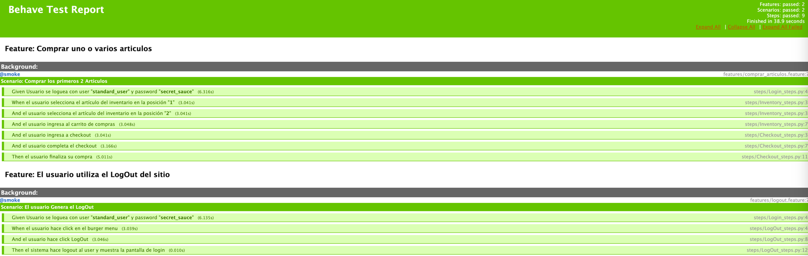

# Reto SquadMakers project

### Instalacion y Configuracion 🚀

```
Levantar el proyuecto sobre PyCharm
Instalar sino existe:
pip install -u selenium
pip install behave
pip install behave-html-formatter
pip install webdriver-manager

Run "behave -f html -o behave-report.html" in terminal for All Test With Report
Run "behave -i logout.feature" in terminal for logout tests
Run "behave -i comprar_articulos.feature.feature" in terminal for comprar_articulos.feature tests
```
### Tecnologia Implementada 📋

```
Se implemento sobre PyCharm utilizando Behave y Gherkin para la implementacion de BDD, ademas se implemento 
Page Object Model como Patron de diseño para poder modelar las páginas y sus comportamientos fomentando la mantenibilidad 
y escalabilidad del proyecto.
```

### Reportes 📋



### Otros 📋

```
Posibles Mejoras:
-Otro tipo de reporte mas dinamico (Allure)
-Integracion con CI/CD (Github Actions)
-Se agregaron algunos sleep(seg), esto es una mala practica, solo se dejan para que se pueda ver bien el paso a paso.
-No se implementaron tags especificos, solo genericos (smoke). 
```


Que tenga un gran dia quien lea esto! Bye! 